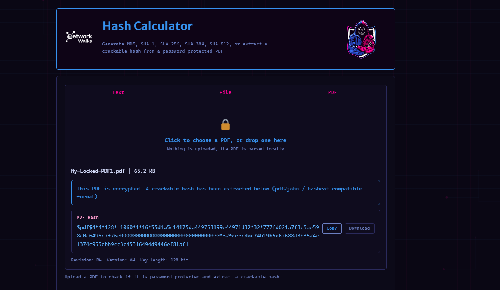
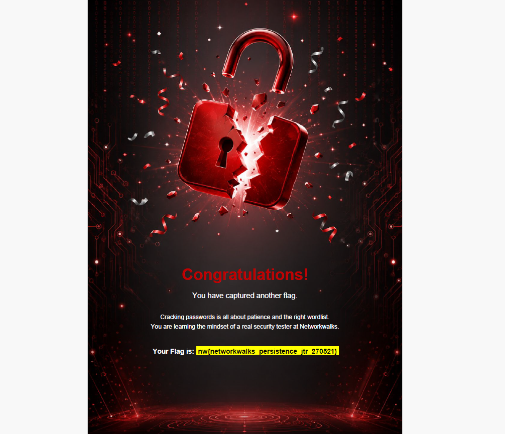

# 🔐 Authentication Attacks & Password Cracking - Week 3

## 📌 Project Overview

This module centers on practical password recovery and dictionary attacks utilizing John the Ripper (JTR), Johnny GUI, and Networkwalks web utilities. 
The primary goal is to comprehend the process of extracting cryptographic hashes from secured documents (like PDFs) and to practically illustrate the vulnerabilities of weak or predictable passwords. 
The lab environment incorporates both local applications and browser-based tools to isolate hash values and execute high-speed comparisons against curated wordlists, ultimately recovering the plain-text credentials.

A core principle emphasized throughout this lab is the essential difference between two distinct cryptographic mechanisms:
*   **Encryption:** A reversible, two-way operation built to safeguard sensitive data. Encrypted content can be restored to its original plain-text state using the appropriate decryption key.
*   **Hashing:** An irreversible, one-way mathematical process used for data validation. It transforms plain text into a fixed-length message digest, which cannot be directly "decrypted" and requires dedicated cracking techniques to uncover the original input.

---

## 🔓 W3-PM1: Password Cracking Using JTR

In the initial required module, I utilized **John the Ripper (JTR)** to perform authorized hash extraction and password recovery operations on locked PDF files.

The practical workflow involved configuring the local toolkit, extracting the necessary hashes from the target PDFs, executing dictionary attacks, reviewing the generated output, and manually testing the recovered passwords to confirm access.

### Key Takeaway
A document's protection relies entirely on the complexity of its password and the underlying encryption algorithm. Furthermore, any successfully cracked password must be practically tested against the target file to ensure true recovery.

---


## 🔑 W3-PM2: Password Cracking via Networkwalks Tools

For the second required module, the focus shifted to utilizing the browser-based **Networkwalks Hash & Password Cracker** to execute structured dictionary attacks.

This phase outlines the complete password recovery workflow—starting from the initial extraction of hashes through to the final cracking and access verification—across the assigned PDF targets.


## 📸 Visual Evidence

### Hash Extraction

The screenshot below illustrates the Networkwalks Hash Calculator isolating a crackable `$pdf$` hash from the secured `My-Locked-PDF1.pdf` document.





### Successful Recovery & Flag Captures

This image verifies the successful recovery of the password, displaying the unlocked PDF alongside the first captured flag and confirmation message.


---

The second flag was obtained following a persistent dictionary attack, highlighting why patience and the selection of an appropriate wordlist are crucial during security assessments.




---

### Key Takeaway

Regardless of the specific application or graphical interface used, the fundamental process for password recovery is consistent: precise hash extraction, the application of effective wordlists, and manual outcome verification are the primary components of success.

---


## 🤖 W3-OPTIONAL1: AI Integration via Claude Desktop & HexStrike MCP

This elective module explored an **AI-assisted security workflow** by pairing Claude Desktop with the HexStrike Model Context Protocol (MCP).

The outlined process details the entire deployment lifecycle: installing the base software, resolving required dependencies, configuring the MCP server, confirming network connectivity, and running the assigned password-cracking tasks.

---


## 📂 Repository Structure


```text

cyber-lab-setup-week-3/
├── images/
│   ├── .gitkeep
│   ├── Hash-Calculator.png
│   ├── My-Locked-PDF1.png
│   └── My-Locked-PDF2.png
└── README.md
```

---


### Challenge Encountered
Setting up the dependencies and finalizing the MCP configuration required significant troubleshooting before the environment became operational. I intentionally preserved the evidence of these initial setup hurdles in the documentation, as recording errors and their subsequent fixes is essential for demonstrating realistic, reproducible lab work.

---

## 🌐 W3-OPTIONAL2 — Web Authentication Assessment

The final optional module involved conducting an authorized authentication attack against a web portal.

I tested various wordlists and applied multiple troubleshooting techniques throughout the process. Ultimately, **no valid credentials were recovered during the testing window**, and subsequent analysis revealed connectivity limitations with the target infrastructure.

Consequently, the status of this module is officially recorded as:


### ⚠️ Best-Effort Attempt — No Valid Password Recovered

It is important to emphasize that failing to recover a password does **not** guarantee an account is secure. It simply indicates that the specific candidate lists and attack vectors applied during this session were unsuccessful.

All published artifacts for this module, including screenshots and output logs, have been fully sanitized and redacted for safe public disclosure.

---


## 🛠️ Acquired Skills & Competencies

### Password Recovery & Cryptography
- Executing offline dictionary attacks using John the Ripper (JTR)
- Isolating and extracting cryptographic hashes from secured PDF files
- Curating, refining, and applying specialized candidate wordlists
- Conducting manual verification of cracked credentials to confirm access

### AI-Augmented Security Operations
- Deploying Claude Desktop for automated security assessments
- Integrating and operating HexStrike AI tools
- Setting up and managing Model Context Protocol (MCP) servers
- Troubleshooting environment setups and resolving software dependencies
- Validating network connectivity and tool interoperability

### Web Authentication Testing
- Inspecting and analyzing HTTP login request parameters
- Deploying custom wordlists for targeted brute-force testing
- Diagnosing and troubleshooting Hydra attack workflows
- Analyzing and documenting the technical outcomes of authentication tests

### Technical Reporting & Evidence Management
- Collecting and structuring digital evidence systematically
- Managing and organizing visual artifacts and screenshots
- Preserving terminal logs and command-line outputs for reproducibility
- Sanitizing and redacting sensitive data for safe public disclosure
- Authoring comprehensive, professionally structured technical reports
- Documenting best-effort attempts and unsuccessful attack vectors objectively

---

## 🔗 Tools & Technologies

The password cracking and authentication testing exercises in this module were executed using the following utilities and platforms:

* **[John the Ripper (JTR)](https://www.openwall.com/john/)**: A widely used open-source utility designed for offline password recovery and dictionary attacks.
* **[Johnny GUI](https://openwall.info/wiki/john/johnny)**: The graphical front-end for JTR, which simplifies the configuration and execution of hash-cracking tasks.
* **[Networkwalks Hash Calculator](https://networkwalks.com/hash-calculator/)**: A browser-based extraction tool utilized to isolate crackable `$pdf$` hashes from secured documents.
* **[Networkwalks Password Cracker](https://networkwalks.com/password-cracker/)**: A web application used to run dictionary attacks against extracted hashes directly within the browser.
* **[OnlineHashCrack](https://www.onlinehashcrack.com/tools-pdf-hash-extractor.php)**: An external web service used to extract and format PDF hashes for compatibility with JTR and Hashcat.
* **Claude Desktop**: The primary AI agent deployed to assist with configuring and automating advanced security operations.
* **HexStrike MCP**: The Model Context Protocol server that interfaces with Claude to manage and execute local security tooling.
* **Hydra**: A fast, parallelized network brute-force tool utilized for the web-portal authentication assessment.

---


## 👤 Author


**Salim Akiki**  
Cybersecurity Student

**LinkedIn:** [https://www.linkedin.com/in/salim-akiki-82911a22a](https://www.linkedin.com/in/salim-akiki-82911a22a?utm_source=share_via&utm_content=profile&utm_medium=member_android)


---
